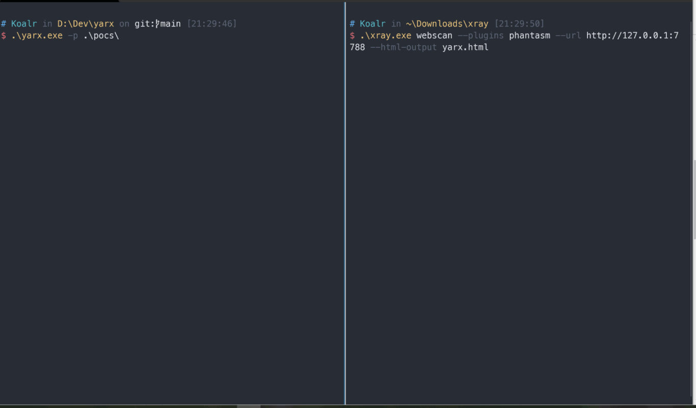

Yarx comes from the reverse spelling of `x-r-a-y`, and it can fully automatically generate a Server that satisfies the rules according to xray's yaml poc rules.Scanning the server with xray will get a dozen of  corresponding vulnerabilities.

## Try this website with your xray!

```bash
./xray webscan --plugins phantasm --html-output yarx.html --url https://yarx.koalr.me
```



## View an example vulnerability scan report

Click here: [https://yarx.koalr.me/yarx.html](https://yarx.koalr.me/yarx.html)

